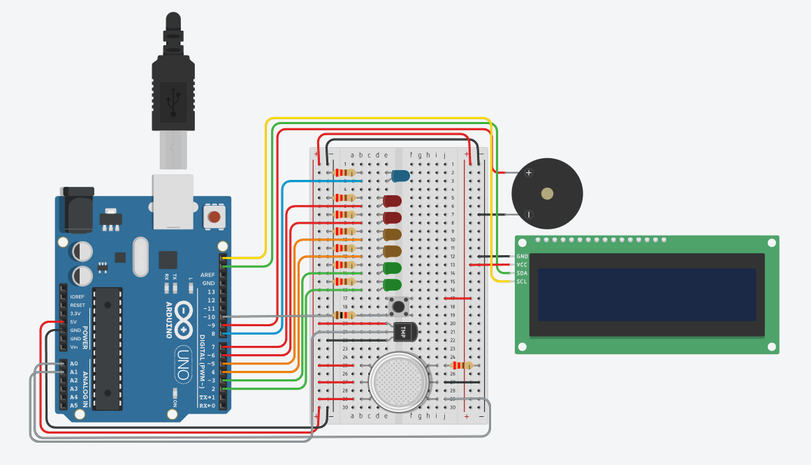

# 🔥 Smoke Detector System with LCD & Buzzer Alert

A modular Arduino-based smoke and temperature detection system using analog sensors, visual indicators, and audible alarms. Designed for real-time environmental monitoring and alerting, this project integrates an LCD display, piezo buzzer, and LED bar to represent escalating hazard levels.

---

## 📸 System Overview

### Physical Setup
_Include an image showing the assembled system with Arduino, sensors, LCD, buzzer, and LEDs._



### Electrical Diagram
_Include a schematic or Fritzing diagram showing wiring between components._


---

## 🧠 Features

- ✅ LCD status display with real-time smoke readings
- 🚨 Multi-level LED indicators for smoke intensity
- 🔊 Buzzer alarm for dangerous smoke or temperature levels
- 🌡️ Temperature monitoring via analog sensor (TMP36)
- 🧵 Modular pin assignments for easy hardware expansion
- 🧪 Pushbutton reset for safe state reinitialization

---

## 🛠️ Hardware Requirements

| Component                  | Quantity |
|---------------------------|----------|
| Arduino Uno/Nano          | 1        |
| Adafruit LiquidCrystal    | 1        |
| Analog Smoke Sensor       | 1        |
| TMP36 Temperature Sensor  | 1        |
| Piezo Buzzer              | 1        |
| LEDs (Red/Yellow/Green)   | 6–7      |
| Pushbutton                | 1        |
| Resistors                 | As needed|
| Jumper Wires              | —        |
| Breadboard                | 1        |

---

## ⚙️ Pin Configuration

| Pin | Function               |
|-----|------------------------|
| A0  | Smoke sensor input     |
| A1  | Temperature sensor input |
| 2–7 | LED indicators         |
| 8   | Safe status LED        |
| 9   | Buzzer output          |
| 10  | Pushbutton input       |

---

## 🧾 Code Summary

The system initializes in a "SAFE" state. It continuously monitors:

- **Smoke levels** via analog input and maps them to LED stages.
- **Temperature** using TMP36, triggering warnings above 100°C.
- **Pushbutton** to reset the system to safe mode.

If smoke exceeds thresholds or temperature spikes, the system escalates visual indicators and activates the buzzer.

---

## 🚀 Getting Started

1. Clone this repository:
   ```bash
   git clone https://github.com/yourusername/smoke-detector-system.git
